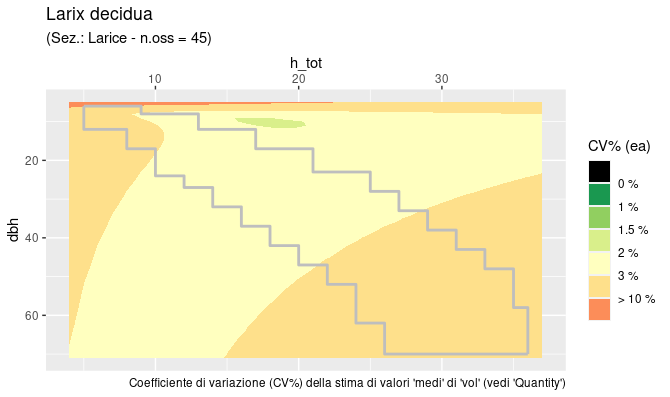
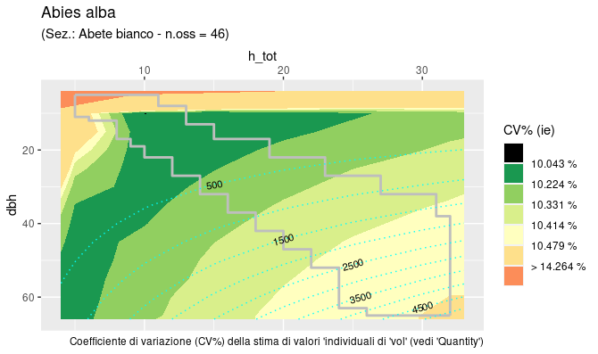

# ForIT


The functions estimating tree volume and aboveground (ABG) phytomass for the 2nd Italian National 
Forest Inventory (2005) are documented in Tabacchi et al. (2011). 
(The section of the the publication exposing "Methods and results global evaluation"  is accessible 
[here](https://drive.google.com/file/d/1uHgkxG6pJqSnfephJ6_yKOlOQFlAurIV/view?usp=sharing)
Regression models have been developed based on sample trees collected within three successive projects, 
in order to consider, as much as possible, all of the most relevant tree species present in Italian forests.  

Providing such a general and uniform estimation tool, these functions have been adopted
by Italian foresters as reference functions. Many professionals and researchers have copied, 
from the paper print or the PDF file, the small subset of coefficient values required to
tackle their problem at hand.   
The package offers an easier (and more reliable) way to proceed. Moreover, since coefficients were 
not readily available through a digital tool, the valuable information that the work developed for 
the evaluation of estimates accuracy, has been practically ignored.  
Using the `ForIT` package, all estimates are associated with accuracy evaluations, through attributes.

The independent variables used in the model are the diameter-at-breast-height ($`dbh`$) and 
the total tree height ($`h_{tot}`$). The general model formulation adopted is the following:

``` math
{y_0 = b_0 + b_1 × dbh^2 × h_{tot} + b_2 × dbh}
```
where $`y_0`$ is the volume or AGB phytomass.

Through the `ForIT` package, all the Tabacchi et al. (2011) volume and phytomass estimation 
functions are readily available in the R environment.

### Package installation

The version under development can be installed using:
``` r
devtools::install_gitlab("NuoroForestrySchool/forit")  
```

### Detailed description with examples
``` r
library(tidyverse)
library(ForIT)
```

The package functions cover three main areas:  
1\) the estimation of tree quantities, for single trees or as totals;  
2\) tabulation, to obtain the volume or phytomass tables (`INFCtabulate()`);  
3\) graphical accuracy assessment (`INFCaccuracyPlot0()` and `INFCaccuracyPlot()`).  

Connecting the package with well established operational standards, the 'tree species codes' used by `ForIT` are the “EPPO codes”. 
(See <https://gd.eppo.int>, for more info on EPPO project and `data(INFCspecies)` for a complete list of species used in this package).  

#### 1\) Volume and AGB tree estimates

Single tree estimates are obtained using the `INFCvpe()` function.  
Otherwise, if interested in estimates for groups of trees, one can refer to the `INFCvpeSUM` family of functions.

##### 1.1 - Single tree estimates
Estimation of the volume of one *Acer campestre* tree (EPPO code is ‘ACRCA’) with diameter-at-breast-height equal to 22 cm and 14 m height.

``` r
vol <- INFCvpe("ACRCA", dbh.cm = 22, htot.m = 14)
```
The default estimated quantity is volume (`quantity = "vol"`). In this specific case, the estimated volume is 252.96 dm<sup>3</sup>.
``` r
> round(as.numeric(vol),2)
# [1] 252.96
```

The codes and definitions of all the quantities the functions estimate are listed in the ‘Quantities’ table:
``` r 
> ForIT::Quantities
# # A tibble: 5 × 2
#   quantity quantity_definition                         
#    <chr>    <chr>                                       
#  1 vol      volume of the stem and large branches [dm^3]
#  2 dw1      phytomass of the stem and large braches [kg]
#  3 dw2      phytomass of the small branches [kg]        
#  4 dw3      phytomass of the stump [kg]                 
#  5 dw4      phytomass of the whole tree [kg]   
```
Volume is expressed in [dm<sup>3</sup>], while all the quantities referred to phytomass are expressed in [kg].  

The attributes accompanying each estimated value, specify accuracy evaluations for the selected quantity. 
`wrv`  is the ;
`Var_ea` is the variance for an estimated average;  
`Var_ie`  the variance for an individual estimate;  
`InDomain` is a logical indicating whether the (dbh, htot) point lies out of
the domain explored by the experimental data (see `INFCtabulate()`).  

``` r
> vol
# [1] 252.9581
# attr(,"pag")       # page number, referred to original source
# [1] 231
# attr(,"quantity")  # see above
# [1] "vol"
# attr(,"wrv")       # weighted residual variance
# [1] 2.271e-05
# attr(,"Var_ea")    # variance for an estimated average
# [1] 33.17182
# attr(,"Var_ie")    # variance for an individual estimate
# [1] 1075.883
# attr(,"InDomain")  # logical indicating whether the (dbh, htot) point lies within the domain 
# [1] TRUE
```

##### 1.2 - Estimates for groups of trees
Cumulative estimation of the volume or phytomass of groups of trees is just the summation of 
the values computed with INFCvpe(), but the computation of accuracy estimates is improved using these summation functions.

Two approaches are available.

##### 1.2.1 - Via `INFCvpe_summarise()`

This function, alternative to `dplyr::summarise()`, returns a dataframe (tibble) with unique values combinations in the grouping column/s, defined via `group_by()`, plus a fixed set of columns for estimates and accuracy evaluation.


``` r
ForIT_test_data %>% 
  INFCvpe_summarise("specie", "d130", "h_dendro")
# A tibble: 1 × 6
# Groups:   quantity [1]
#     quantity     n n_out      est   cihw     p
#     <chr>    <int> <int>    <dbl>  <dbl> <dbl>
#   1 vol         17     1    10335.  927.  0.95
```

##### 1.2.2 - Within `dplyr::summarise()`
for each set of rows, defined via `group_by()`, following aggregation functions are available:
* `INFCvpe_sum()`, that  returns the sum of the estimated quantities;
* `INFCvpe_ConfInt()`, that returns 'confidence interval half width';
* `INFCvpe_OutOfDomain()`, that returns the number of 'out of domain' (dbh, h_tot) pairs included in the summation.

For more details on the functions of this family:  `?ForIT::INFCvpeSUM`

#### 2\) `INFCtabulate`

Volume and phytomass functions are tabulated in Tabacchi et al. (2011a). Printed numbers serve as 
reference to verify that coded functions return expected results and, more specifically, empty spaces (or NA) 
in the printed tables limit function applicability domain. In other words, measurement data used to estimate 
function coefficient values, cover only the portion of the (dbh, htot) plane where numbers are printed.

``` r
> INFCtabulate("ACRCA")
# EPPO code:  ACRCA  - pag =  231  - quantity = ' vol '
# htot.m
# dbh.cm    5    8    11    14    17     20     23
# 5       6.3  9.1    NA    NA    NA     NA     NA
# 10     20.2 31.4  42.5    NA    NA     NA     NA
# 15       NA 68.4  93.5 118.5    NA     NA     NA
# 20       NA   NA 164.9 209.3 253.8  298.3     NA
# 25       NA   NA    NA 326.2 395.7  465.2     NA
# 30       NA   NA    NA 468.9 569.0  669.2  769.3
# 35       NA   NA    NA    NA 773.9  910.2 1046.5
# 40       NA   NA    NA    NA    NA 1188.3 1366.3
# ---
```
More info at `?ForIT::INFCtabulate`.

#### 3\) Graphical evaluation of estimates accuracy and reliability


The tabulation described in `§2` covers a limited region of the `dbh` by `h_tot` rectangle.  
This region is the "domain" of the reliable estimates, based on the distribution of the sample 
trees used to calibrate the functions. The coefficient of variation (CV = standard_deviation / estimate) 
is computed and plotted (as 'filled contours') for the whole rectangular area, the limits of the region 
of reliable estimates (the "domain"), is superimposed as a light coloured line.
Function output is a `ggplot` object that can be used by itself or as a background on top of which 
the user can plot his/her data to verify eventual accuracy or reliability problems.

##### Two functions are available.

`INFCaccuracyPlot0()` - produces, much faster, the plots at the finest resolution, using pre-calculated 
values stored in a specific auxiliary dataframe (see `INFC_CVgrid`), necessarily leaving less customization freedom.

``` r
INFCaccuracyPlot0("LAXDE") 
```

   
`INFCaccuracyPlot()` - allows the plots to be fully customized but, beware, all values required 
for the 'fill' will be computed and, at finer resolution, the process can be slow.

``` r
INFCaccuracyPlot("ABIAL", ie.Var = T, plot.est = T, cv.ul = .15, fixed = F)
```



#### References

Gasparini, P., Tabacchi, G. (eds), 2011. L’Inventario Nazionale delle
Foreste e dei serbatoi forestali di Carbonio INFC 2005. Secondo
inventario forestale nazionale italiano. Metodi e risultati. Edagricole.
653 pp. 


Tabacchi G., Di Cosmo L., Gasparini P., Morelli S., 2011. Stima del
volume e della fitomassa delle principali specie forestali italiane.
Equazioni di previsione, tavole del volume e tavole della fitomassa
arborea epigea. Stima del volume e della fitomassa delle principali
specie forestali italiane. Equazioni di previsione, tavole del volume e
tavole della fitomassa arborea epigea. 412 pp.
[full text](https://www.inventarioforestale.org/sites/default/files/datiinventario/pubb/tavole_cubatura.pdf)


Tabacchi G., Di Cosmo L., Gasparini P., 2011. Aboveground tree volume
and phytomass prediction equations for forest species in Italy. European
Journal of Forest Research 130: 6 911-934.
